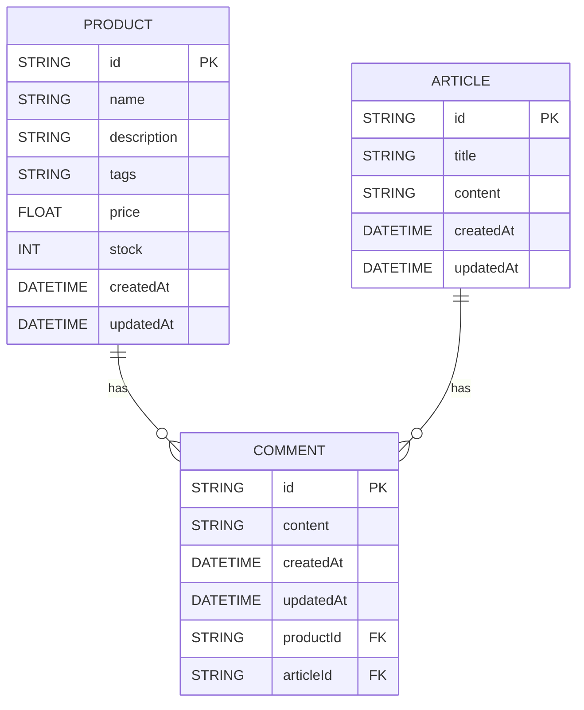

```mermaid
  erDiagram
  PRODUCT {
        STRING id PK
        STRING name
        STRING description
        STRING tags
        FLOAT price
        INT stock
        DATETIME createdAt
        DATETIME updatedAt
    }

  ARTICLE {
        STRING id PK
        STRING title
        STRING content
        DATETIME createdAt
        DATETIME updatedAt
    }
  COMMENT {
        STRING id PK
        STRING content
        DATETIME createdAt
        DATETIME updatedAt
        STRING productId FK
        STRING articleId FK
    }

  PRODUCT ||--o{ COMMENT : "has"
  ARTICLE ||--o{ COMMENT : "has"
```
